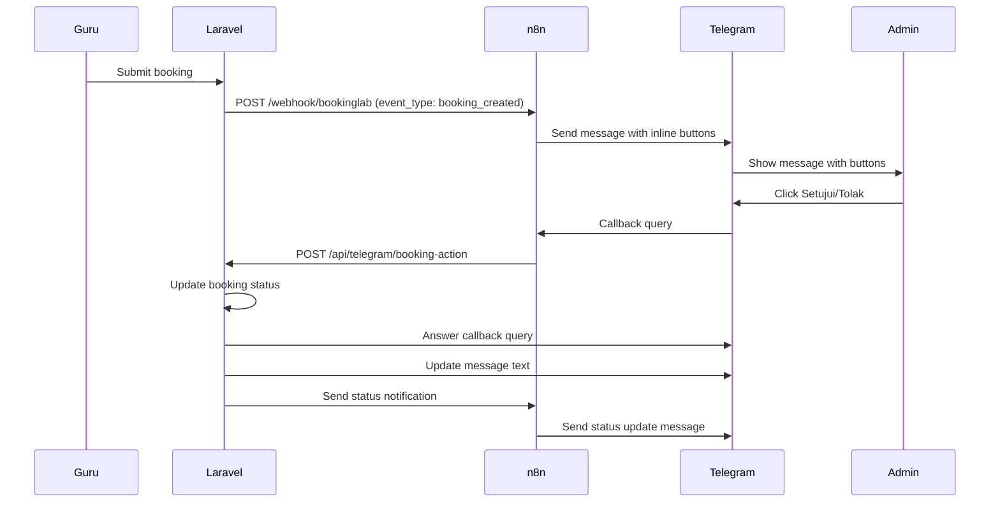

# Implementasi Telegram Bot dengan Tombol Setujui/Tolak

## Gambaran Umum

Implementasi ini memungkinkan admin untuk menyetujui atau menolak pengajuan peminjaman lab langsung melalui Telegram menggunakan tombol inline keyboard, tanpa perlu membuka dashboard web.

## Arsitektur Flow

```
Laravel → n8n Webhook → Telegram (dengan tombol) → Telegram Callback → Laravel API → Update Database
```

### Detail Flow:

1. **Pengajuan Peminjaman** (GuruController)
   - Guru mengajukan peminjaman melalui web
   - Laravel mengirim notifikasi ke webhook n8n dengan `event_type: 'booking_created'`

2. **n8n Flow** (Notif Pinjam Lab.json)
   - Menerima webhook dari Laravel
   - Cek `event_type`:
     - Jika `booking_created`: Kirim ke Telegram dengan tombol Setujui/Tolak
     - Jika lainnya: Kirim pesan biasa
   - Setup callback webhook untuk menerima respons tombol

3. **Telegram Interaction**
   - Admin menerima pesan dengan 2 tombol: ✅ Setujui dan ❌ Tolak
   - Saat tombol diklik, Telegram mengirim callback ke n8n

4. **Callback Processing**
   - n8n menerima callback dari Telegram
   - Parse data callback (action, booking_id, dll)
   - Kirim ke Laravel API endpoint

5. **Laravel API Processing** (TelegramController)
   - Validasi token keamanan
   - Update status booking di database
   - Update pesan Telegram dengan status baru
   - Kirim notifikasi status update

## File-file yang Dimodifikasi/Ditambah

### 1. `Notif Pinjam Lab.json` - n8n Workflow
- Ditambah node conditional untuk cek `event_type`
- Ditambah inline keyboard untuk booking requests
- Ditambah webhook callback handler
- Ditambah HTTP request ke Laravel API

### 2. `TelegramController.php` - Controller Baru
- `handleBookingAction()`: Menangani callback dari Telegram
- `approveBooking()`: Approve booking via Telegram
- `rejectBooking()`: Reject booking via Telegram
- `answerCallbackQuery()`: Kirim feedback ke user
- `updateTelegramMessage()`: Update pesan dengan status
- `sendStatusNotification()`: Kirim notif status ke n8n

### 3. `routes/web.php` - Route Baru
- Ditambah route API: `/api/telegram/booking-action`

### 4. `config/services.php` - Konfigurasi
- Ditambah konfigurasi Telegram: `bot_token`, `webhook_token`

### 5. `VerifyCsrfToken.php` - Middleware
- Exclude route API Telegram dari CSRF

### 6. `.env.n8n.example` - Environment Variables
- Ditambah `TELEGRAM_BOT_TOKEN`
- Ditambah `TELEGRAM_WEBHOOK_TOKEN`

## Konfigurasi yang Diperlukan

### 1. Environment Variables (.env)
```bash
# Telegram Bot Token dari @BotFather
TELEGRAM_BOT_TOKEN=123456789:ABCDefGHIjklMNOpqrsTUVwxyz

# Token keamanan untuk webhook (generate random string)
TELEGRAM_WEBHOOK_TOKEN=your_secure_random_token_here

# URL webhook n8n
N8N_WEBHOOK_URL=https://your-n8n-instance.com/webhook/bookinglab

# Laravel app URL untuk n8n callback
LARAVEL_APP_URL=https://your-laravel-app.com
```

### 2. n8n Environment Variables
Dalam n8n, set environment variables:
```bash
LARAVEL_APP_URL=https://your-laravel-app.com
TELEGRAM_WEBHOOK_TOKEN=your_secure_random_token_here
```

### 3. Telegram Bot Setup
1. Buat bot baru melalui @BotFather
2. Dapatkan bot token
3. Dapatkan Chat ID grup Telegram admin
4. Set webhook URL di n8n untuk callback

## Struktur n8n Workflow Baru

### Nodes:
1. **Webhook** - Menerima dari Laravel
2. **Check Event Type** - Conditional node
3. **Send Booking Request** - Kirim dengan tombol (untuk `booking_created`)
4. **Send Status Update** - Kirim pesan biasa (untuk status updates)
5. **Telegram Callback** - Webhook untuk callback
6. **Parse Callback** - Parsing callback data
7. **Call Laravel API** - HTTP request ke Laravel

### Webhook URLs yang Dibutuhkan:
1. **Booking Notification**: `/webhook/bookinglab` (existing)
2. **Telegram Callback**: `/webhook/telegram-callback` (new)

## Keamanan

### 1. Token Validation
- API endpoint melakukan validasi `X-Telegram-Token` header
- Token harus match dengan `TELEGRAM_WEBHOOK_TOKEN`

### 2. Input Validation
- Validasi action hanya `approve` atau `reject`
- Validasi booking ID dan status
- Cek apakah booking masih pending

### 3. CSRF Protection
- Route API dikecualikan dari CSRF (external webhook)
- Menggunakan token validation sebagai gantinya

## Cara Testing

### 1. Test Manual
1. Login sebagai guru dan ajukan peminjaman
2. Cek grup Telegram admin, harusnya ada pesan dengan tombol
3. Klik tombol Setujui atau Tolak
4. Pesan harusnya update dengan status
5. Cek dashboard admin, status harusnya berubah

### 2. Test via Command
```bash
# Test webhook notification
php artisan test:webhook-direct

# Test Telegram safe
php artisan test:telegram-safe
```

## Logging dan Monitoring

### Log Events:
- Telegram callback received
- Booking approved/rejected via Telegram
- Failed token validation
- API errors

### Log Locations:
- `storage/logs/laravel.log`
- n8n execution logs

## Troubleshooting

### 1. Tombol Tidak Muncul
- Periksa `event_type` yang dikirim Laravel
- Pastikan conditional node n8n benar
- Cek format inline keyboard n8n

### 2. Callback Gagal
- Periksa URL callback webhook n8n
- Cek token validation
- Pastikan Laravel API route accessible

### 3. Status Tidak Update
- Cek log Laravel untuk error
- Pastikan booking ID valid
- Cek database connection

### 4. Pesan Tidak Update di Telegram
- Periksa bot token
- Cek message_id dari callback
- Pastikan bot punya permission edit message

## Fitur Tambahan yang Bisa Dikembangkan

1. **Alasan Penolakan**: Input alasan saat menolak
2. **Konfirmasi**: Konfirmasi sebelum approve/reject
3. **Multiple Admin**: Tracking siapa yang memproses
4. **Notifikasi ke Guru**: Notif Telegram ke guru saat diproses
5. **Statistics**: Tracking response time admin
6. **Batch Actions**: Approve/reject multiple bookings

## Diagram Sequence



## Kesimpulan

Implementasi ini meningkatkan efisiensi admin dalam mengelola peminjaman lab dengan memungkinkan persetujuan langsung melalui Telegram tanpa perlu membuka dashboard web. Flow yang terintegrasi antara Laravel, n8n, dan Telegram memberikan pengalaman yang seamless dan real-time.
